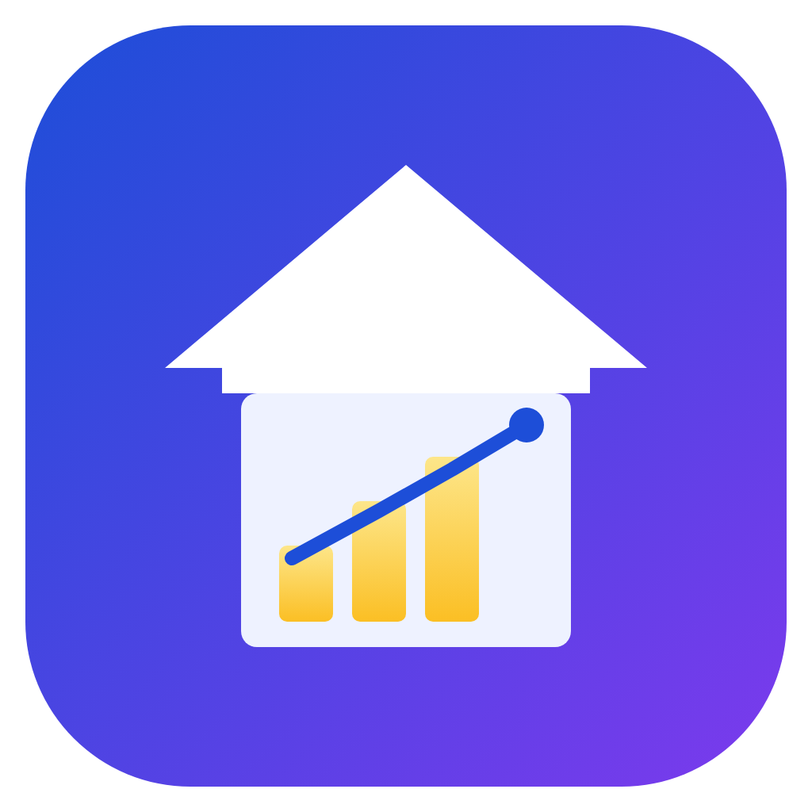
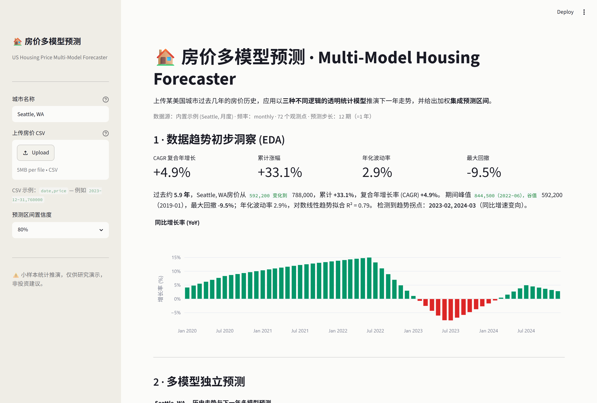
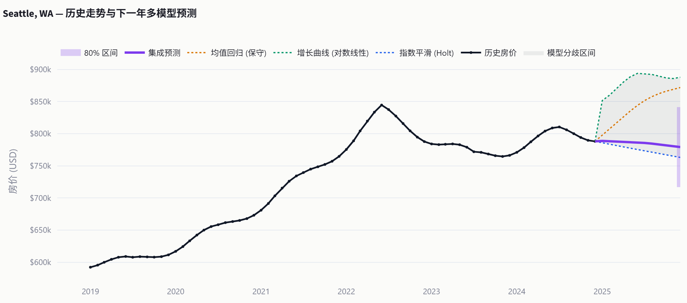
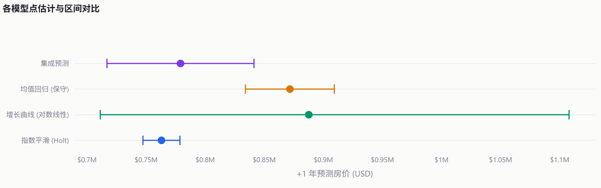
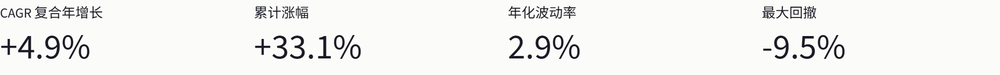
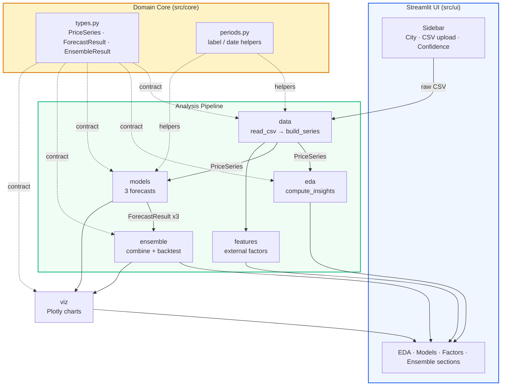
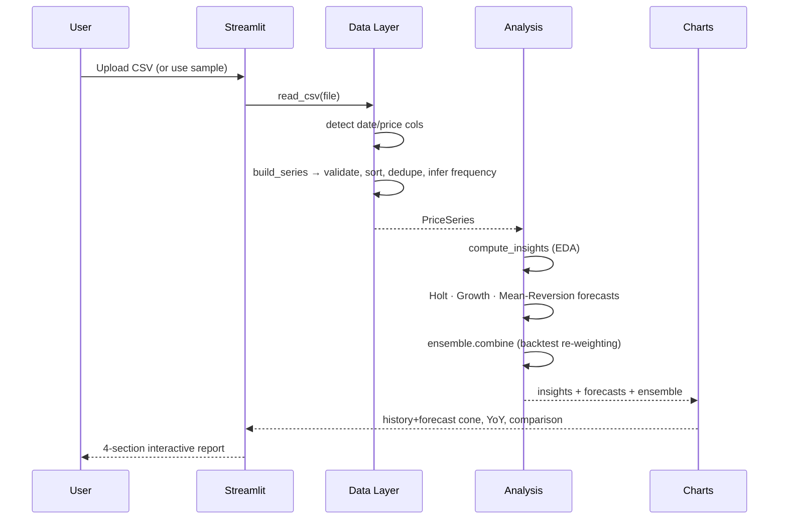
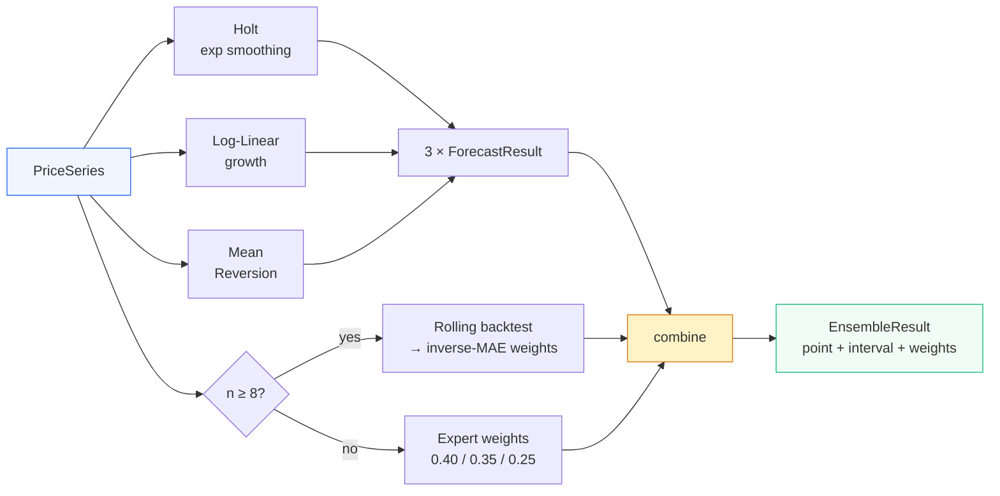
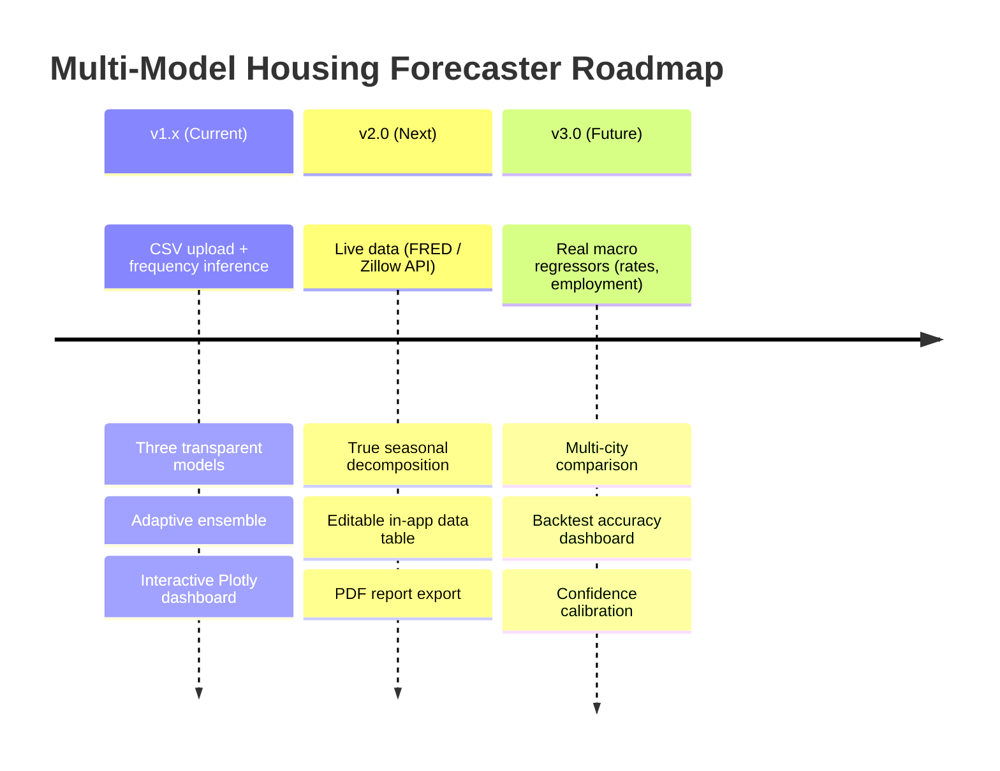

<p align="center">
  
</p>

<h1 align="center">房价多模型预测 · Multi-Model Housing Forecaster</h1>

<p align="center">
  <strong>Forecast a US city's next-year home prices with three independent statistical models — and a weighted ensemble.</strong><br/>
  Upload 5 years of price history, get an EDA breakdown, three transparent model forecasts, external-factor analysis, and a final ensemble range.
</p>

<p align="center">
  
  
  
  
  
  
  
  
</p>

<p align="center">
  <a href="#-quick-start"><strong>Quick Start</strong></a> ·
  <a href="#-methodology"><strong>Methodology</strong></a> ·
  <a href="#-architecture"><strong>Architecture</strong></a> ·
  <a href="#-deploy"><strong>Deploy</strong></a>
</p>

---

## 📸 Demo

> The screenshots below are the live app rendering the bundled **Seattle, WA** monthly sample (72 points, 2019–2024).

### Full Application View


| Multi-Model Forecast | Model Comparison | EDA Metrics |
|---|---|---|
|  |  |  |

The hero chart overlays the price history with all three model paths, the **ensemble line**, a shaded **model-disagreement cone**, and the final **80% prediction interval**.

---

## ✨ Features

- **CSV Upload** — drop in any city's price history (annual, quarterly, or monthly; frequency auto-detected).
- **Four-section analysis** — EDA → three independent model forecasts → external-factor reasoning → weighted ensemble, mirroring a real data-scientist workflow.
- **Three transparent models** — exponential smoothing, log-linear growth, and conservative mean-reversion. No black boxes: every formula is in the code, every forecast is reproducible.
- **Honest about small samples** — uses lightweight statistics (numpy/pandas only) that stay valid where ARIMA/Prophet would not, with a prominent "illustrative, not advice" disclaimer.
- **Adaptive ensemble** — fixed expert weights by default; switches to **backtest-derived inverse-error weights** when there's enough data.
- **Interactive Plotly charts** — history + forecast paths, disagreement cone, prediction bands, YoY growth, and a model-comparison interval plot.
- **Built-in sample** — loads a realistic Seattle dataset on first run, so the app is a full demo out of the box.

---

## 🚀 Quick Start

```bash
# 1. Clone
git clone https://github.com/SuperGokou/housing_price_prediction.git
cd housing_price_prediction

# 2. Create a virtual environment + install runtime deps
python -m venv .venv
# Windows:
.venv\Scripts\activate
# macOS / Linux:
source .venv/bin/activate
pip install -r requirements.txt

# 3. Run
streamlit run app.py
```

Then open the URL Streamlit prints (default <http://localhost:8501>).

> **Windows note:** Hyper-V/WSL may reserve the default `8501` port range. If Streamlit reports *"Port 8501 is not available"* while nothing is listening, run on a free port outside the reserved range:
> ```bash
> streamlit run app.py --server.port 7000
> ```

### Run the tests

```bash
pip install pytest pytest-cov
pytest --cov=src --cov-report=term-missing
```

---

## 🧪 Methodology

The app reproduces the four-part analysis a senior analyst would produce. Example output below uses the bundled **Seattle** sample (last observed price **$788,000**).

### 1 · Exploratory Data Analysis

| Metric | Seattle sample |
|---|---|
| CAGR (compound annual growth) | **+4.9%** |
| Total growth (2019→2024) | **+33.1%** |
| Annualized volatility | 2.9% |
| Max drawdown | **−9.5%** |
| Log-linear trend R² | 0.79 |
| Detected inflections (YoY sign change) | 2023-02, 2024-03 |

### 2 · Three Independent Models

Each model embodies a different forecasting philosophy. With only a handful of points, **transparent statistics beat over-fit ML** — so these are reproducible closed-form methods, not heavyweight black boxes.

| Model | Logic | Method | Seattle +1yr | 80% interval |
|---|---|---|---|---|
| **指数平滑 · Holt** | Autocorrelation & moving-average of recent levels | Double exponential smoothing; grid-searched `α, β` minimizing one-step SSE; forecast = `level + h·trend` | **$763,021** | $747k – $779k |
| **增长曲线 · Log-Linear** | Continuation of the macro compounding trend (Prophet-style) | OLS fit of `log(price) ~ a + b·t`; optional additive seasonality for sub-annual data | **$887,718** | $711k – $1,108k |
| **均值回归 · Conservative** | Extreme moves revert toward long-run fair value | `next = prev + θ·(fairᵗ − prev)`, `θ` from AR(1) decay of trend deviations, clamped `[0.15, 0.85]` | **$871,732** | $834k – $909k |

Each model returns a point estimate at the **+1-year horizon**, a full forecast path, an interval (from in-sample residual spread scaled by √horizon), and a plain-language rationale.

### 3 · External-Factor Reasoning

The app lists the macro variables that — if known — would most revise the forecast, and the **direction** each would push it (tilting its emphasis based on the series' recent momentum):

| Factor | Effect |
|---|---|
| **Mortgage rates** | Inverse: rising rates suppress demand → ⬇️ downward revision |
| **Core-industry employment** | Net high-wage job inflows lift demand → ⬆️ upward revision |
| **Inventory / months of supply** | Rising supply weakens pricing power → ⬇️ downward revision |

### 4 · Ensemble Forecast

The final number is a weighted blend. With ≥8 observations the app runs a **rolling one-step-ahead backtest** and re-weights each model by inverse mean-absolute-error; otherwise it uses **expert weights** (Holt 0.40 / Growth 0.35 / Mean-Reversion 0.25).

```
Ensemble point = Σ wᵢ · pointᵢ
σ = √( Σ wᵢ·(half-widthᵢ/z)²  +  Σ wᵢ·(pointᵢ − point)² )   ← within-model + between-model variance
interval = point ± z·σ
```

**Seattle result** — method: `backtest-inverse-error`, weights Holt **0.86** / Growth 0.02 / Mean-Reversion 0.12:

> ### 📊 Final forecast: **$779,128**  ·  80% range **$716,913 – $841,344**

---

## 🏗 Architecture

```
housing_price_prediction/
├── app.py                       # Streamlit entry point — orchestration only
├── requirements.txt
├── pyproject.toml               # pytest config (pythonpath, testpaths)
├── .streamlit/config.toml       # theme + upload limit
├── sample_data/
│   ├── seattle.csv              # monthly demo dataset (72 points)
│   └── seattle_annual.csv       # the 5-point annual example
├── src/
│   ├── core/                    # CONTRACT layer (shared, no deps)
│   │   ├── types.py             #   PriceSeries, EdaInsights, ForecastResult, EnsembleResult
│   │   └── periods.py           #   calendar/label helpers
│   ├── data/                    # CSV ingestion & validation
│   │   ├── io.py                #   read_csv (path | bytes | UploadedFile)
│   │   ├── validation.py        #   build_series (clean, sort, dedupe, validate)
│   │   └── frequency.py         #   infer annual / quarterly / monthly
│   ├── eda/insights.py          # CAGR, volatility, drawdown, inflections, trend R²
│   ├── models/                  # the three models + ensemble
│   │   ├── exponential_smoothing.py
│   │   ├── growth_curve.py
│   │   ├── mean_reversion.py
│   │   └── ensemble.py
│   ├── features/external_factors.py   # macro-variable narrative
│   ├── viz/charts.py            # Plotly figure builders
│   └── ui/                      # Streamlit sections (sidebar, eda, models, ensemble)
├── tests/                       # 111 pytest cases, 85% coverage
└── docs/superpowers/specs/      # design spec
```

### High-Level Architecture



### Data-Flow Pipeline



### Model Pipeline



---

## 📄 CSV Format

Two columns; the headers are matched case-insensitively (a date-like column and a price-like column), with positional fallback to `[col 0 = date, col 1 = price]`:

```csv
date,price
2019-12-31,600000
2020-12-31,650000
2021-12-31,720000
2022-12-31,780000
2023-12-31,760000
```

- Frequency (annual / quarterly / monthly) is inferred from the row spacing.
- Prices may include `$` and thousands separators (`"$760,000"`).
- Rows are sorted ascending, duplicate dates de-duplicated (last wins), non-positive prices rejected. Minimum 3 rows.

---

## ✅ Testing

111 deterministic `pytest` cases, 85% overall coverage (95–100% on all non-UI logic):

```bash
pytest --cov=src --cov-report=term-missing
```

Tests cover CSV edge cases (unsorted, duplicate dates, `$`/comma prices, non-positive, garbage), frequency inference, closed-form EDA checks, model behavior (monotone-up → forecast rises; flat → forecast holds; intervals bracket the point), and ensemble weight/interval invariants.

---

## 🧰 Tech Stack

| Layer | Technology |
|---|---|
| App framework | Streamlit 1.58 |
| Data | pandas · NumPy |
| Models | Hand-rolled statistics (Holt, OLS log-linear, AR(1) mean-reversion) |
| Charts | Plotly |
| Testing | pytest · pytest-cov |
| Language | Python 3.10+ |

No statsmodels, Prophet, or scikit-learn — every model is a few dozen lines of transparent numpy.

---

## 🌐 Deploy

This is a standard Streamlit app — deploy free on **Streamlit Community Cloud**:

1. Push this repo to GitHub.
2. Go to [share.streamlit.io](https://share.streamlit.io) → **New app**.
3. Point it at your repo, set the main file to `app.py`. It auto-installs `requirements.txt`.
4. Deploy. No secrets or API keys required.

[](https://share.streamlit.io/deploy)

---

## ⚠️ Limitations & Disclaimer

- Designed for **small samples**; the methods are illustrative statistical extrapolations, **not** trained ML on large datasets.
- No live data feeds, validation against external indices, or true macro-variable modeling (mortgage rates, employment, and inventory are reasoned about qualitatively, not ingested).
- **This tool does not constitute investment, real-estate, or financial advice.**

---

## 🗺 Roadmap



---

## 🤝 Contributing

1. Fork the repo and create a feature branch (`git checkout -b feature/my-feature`).
2. Keep the contract in `src/core/types.py` stable; add models/metrics behind it.
3. Write tests first (`pytest`), keep coverage ≥ 80%.
4. Open a pull request.

## 📜 License

[MIT](LICENSE) © Ming Xia
